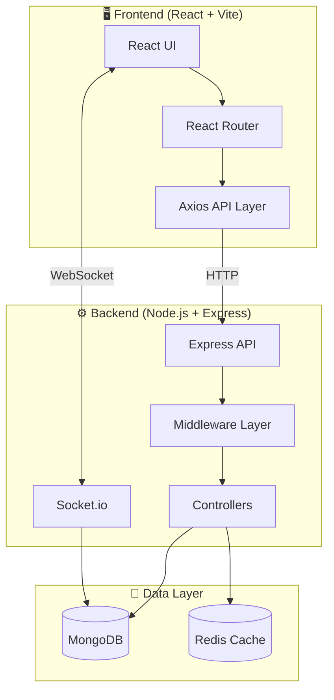
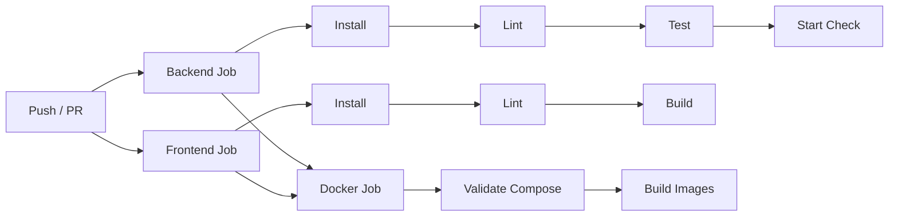

# 🚀 ServiceGo

**ServiceGo** is a full-stack MERN service marketplace for booking local home services (plumbing, cleaning, electrical, beauty, etc.) with real-time job management, live tracking, and Razorpay/Stripe payment integration.

> Built with MongoDB, Express.js, React (Vite), Node.js, Socket.io, Redis, and Docker.

---

## 📐 Architecture



---

## 🛠️ Tech Stack

| Layer      | Technology                        |
| ---------- | --------------------------------- |
| Frontend   | React 19, Vite 7, TailwindCSS 4  |
| Backend    | Node.js 20, Express 4             |
| Database   | MongoDB (Mongoose 9)              |
| Cache      | Redis (ioredis)                   |
| Real-time  | Socket.io                         |
| Payments   | Razorpay, Stripe                  |
| Auth       | JWT, Google OAuth                 |
| Maps       | Leaflet / React-Leaflet           |
| DevOps     | Docker, GitHub Actions            |
| Deployment | Render / Vercel / AWS             |

---

## 📁 Folder Structure

```
serviceGo/
├── client/                     # React frontend
│   ├── public/                 # Static assets
│   ├── src/
│   │   ├── api/                # Axios instance & interceptors
│   │   ├── assets/             # Images, icons
│   │   ├── components/         # Reusable UI components
│   │   ├── context/            # React Context (Auth, Cart)
│   │   ├── pages/              # Page components (Home, Login, etc.)
│   │   ├── App.jsx             # Root component with routing
│   │   ├── main.jsx            # Entry point
│   │   └── index.css           # Global styles
│   ├── Dockerfile              # Multi-stage build (Vite → Nginx)
│   ├── nginx.conf              # Nginx config for SPA + API proxy
│   ├── vercel.json             # Vercel SPA rewrite config
│   └── .env.example            # Environment template
│
├── server/                     # Node.js backend
│   ├── config/
│   │   ├── db.js               # MongoDB connection
│   │   └── redis.js            # Redis client (optional)
│   ├── controllers/            # Route handlers
│   │   ├── authController.js
│   │   ├── serviceController.js
│   │   ├── bookingController.js
│   │   ├── paymentController.js
│   │   ├── reviewController.js
│   │   ├── providerController.js
│   │   └── adminController.js
│   ├── middleware/
│   │   ├── auth.js             # JWT authentication
│   │   ├── role.js             # Role-based authorization
│   │   ├── validate.js         # Request validation
│   │   ├── errorHandler.js     # Centralized error handling
│   │   ├── logger.js           # Custom request logger
│   │   └── cache.js            # Redis cache middleware
│   ├── models/                 # Mongoose schemas
│   │   ├── User.js
│   │   ├── Service.js
│   │   ├── Booking.js
│   │   └── Review.js
│   ├── routes/                 # API route definitions
│   ├── socket/                 # Socket.io event handlers
│   ├── utils/                  # Helpers (AppError, email, token)
│   ├── Dockerfile              # Node.js production image
│   └── .env.example            # Environment template
│
├── .github/workflows/
│   └── main.yml                # CI/CD pipeline
├── docker-compose.yml          # Full-stack Docker orchestration
├── render.yaml                 # Render deployment blueprint
├── .env.example                # Root environment template
└── README.md                   # This file
```

---

## 🚀 Getting Started

### Prerequisites

- **Node.js** 20+ and **npm**
- **MongoDB** (local or [Atlas](https://www.mongodb.com/atlas))
- **Redis** (optional — app works without it)
- **Docker** (optional — for containerized setup)

---

### Option 1: Local Development (without Docker)

#### 1. Clone the repository

```bash
git clone https://github.com/your-username/serviceGo.git
cd serviceGo
```

#### 2. Setup backend

```bash
cd server
cp .env.example .env
# Edit .env with your MongoDB URI, JWT secret, payment keys
npm install
npm run dev
```

The backend runs at `http://localhost:5000`.

#### 3. Setup frontend

```bash
cd client
cp .env.example .env
# Edit .env — set VITE_API_URL=http://localhost:5000
npm install
npm run dev
```

The frontend runs at `http://localhost:5173`.

---

### Option 2: Docker (recommended for production-like setup)

#### 1. Setup environment

```bash
cp .env.example .env
# Edit .env with your secrets (JWT_SECRET is required)
```

#### 2. Start all services

```bash
docker compose up --build
```

This starts **4 containers**:

| Service | URL                    | Description              |
| ------- | ---------------------- | ------------------------ |
| Client  | http://localhost       | React app via Nginx      |
| Server  | http://localhost:5000  | Express API              |
| MongoDB | localhost:27017        | Database                 |
| Redis   | localhost:6379         | Cache (optional)         |

#### 3. Stop services

```bash
docker compose down
```

#### 4. Stop and remove all data

```bash
docker compose down -v
```

---

## 🔐 Environment Variables

### Backend (`server/.env`)

| Variable             | Required | Default                      | Description                   |
| -------------------- | -------- | ---------------------------- | ----------------------------- |
| `PORT`               | No       | `5000`                       | Server port                   |
| `NODE_ENV`           | No       | `development`                | Environment mode              |
| `MONGO_URI`          | **Yes**  | —                            | MongoDB connection string     |
| `JWT_SECRET`         | **Yes**  | —                            | JWT signing secret            |
| `REDIS_URL`          | No       | —                            | Redis URL (caching disabled if unset) |
| `CORS_ORIGIN`        | No       | `*`                          | Allowed CORS origin           |
| `STRIPE_SECRET_KEY`  | No       | —                            | Stripe API key                |
| `RAZORPAY_KEY_ID`    | No       | —                            | Razorpay key ID               |
| `RAZORPAY_KEY_SECRET`| No       | —                            | Razorpay secret               |
| `LOG_LEVEL`          | No       | `dev`                        | Logging verbosity             |

### Frontend (`client/.env`)

| Variable                | Required | Description                  |
| ----------------------- | -------- | ---------------------------- |
| `VITE_API_URL`          | **Yes**  | Backend URL (e.g. `http://localhost:5000`) |
| `VITE_GOOGLE_CLIENT_ID` | No      | Google OAuth client ID       |

> **Note:** Vite bakes `VITE_*` variables into the build at compile time. They are **not** runtime secrets.

---

## 🔄 CI/CD Pipeline

The GitHub Actions workflow (`.github/workflows/main.yml`) runs on every push/PR to `main`:



| Job      | Steps                                          |
| -------- | ---------------------------------------------- |
| Backend  | Install → Lint (placeholder) → Test → Startup check |
| Frontend | Install → ESLint → Vite build                  |
| Docker   | Validate `docker-compose.yml` → Build images   |

---

## ☁️ Deployment

### Render (recommended)

1. Push your code to GitHub
2. Connect the repo on [render.com](https://render.com)
3. Render auto-detects `render.yaml` and creates services
4. Set environment variables in the Render dashboard

### Vercel (frontend only)

1. Import the `client/` directory on [vercel.com](https://vercel.com)
2. Set `VITE_API_URL` to your deployed backend URL
3. Vercel uses `vercel.json` for SPA routing

### AWS / Custom VPS

1. Build Docker images:
   ```bash
   docker compose build
   ```
2. Push to a container registry (ECR, Docker Hub)
3. Deploy with ECS, EC2, or any Docker-compatible platform

---

## 🧪 API Endpoints

| Method | Endpoint                    | Auth       | Description              |
| ------ | --------------------------- | ---------- | ------------------------ |
| GET    | `/api/health`               | Public     | Health check             |
| POST   | `/api/auth/register`        | Public     | Register user            |
| POST   | `/api/auth/login`           | Public     | Login user               |
| GET    | `/api/services`             | Public     | List services (cached)   |
| GET    | `/api/services/:id`         | Public     | Get service details      |
| POST   | `/api/services`             | Provider   | Create service           |
| PUT    | `/api/services/:id`         | Provider   | Update service           |
| DELETE | `/api/services/:id`         | Provider/Admin | Delete service       |
| GET    | `/api/services/category-counts` | Public | Category stats (cached)  |
| POST   | `/api/bookings`             | Consumer   | Create booking           |
| GET    | `/api/bookings`             | Auth       | List user bookings       |
| GET    | `/api/bookings/:id`         | Auth       | Booking details          |
| POST   | `/api/reviews`              | Consumer   | Submit review            |
| GET    | `/api/providers`            | Public     | List providers           |
| POST   | `/api/payments/create-order`| Consumer   | Create payment order     |

---

## 📦 Redis Caching

Redis caching is **optional** — the app works perfectly without it.

When enabled (set `REDIS_URL`), these routes are cached:

| Route                         | TTL       |
| ----------------------------- | --------- |
| `GET /api/services`           | 5 minutes |
| `GET /api/services/category-counts` | 10 minutes |

Cache is **automatically invalidated** when services are created, updated, or deleted.

---

## 🤝 Contributing

1. Fork the repository
2. Create your feature branch: `git checkout -b feature/my-feature`
3. Commit changes: `git commit -m 'Add my feature'`
4. Push to branch: `git push origin feature/my-feature`
5. Open a Pull Request

---

## 📄 License

This project is licensed under the ISC License. See the [LICENSE](LICENSE) file for details.
